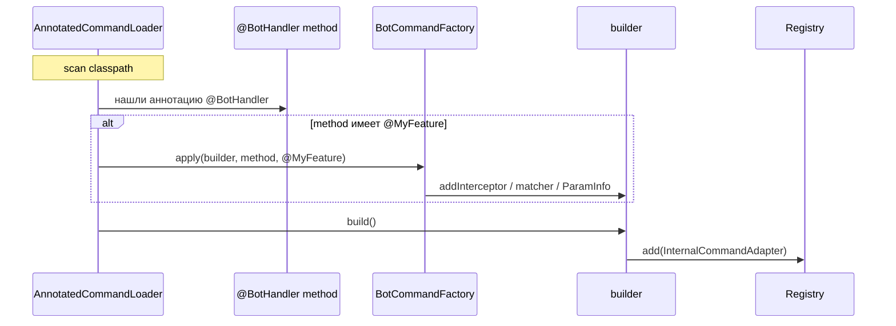

## TL;DR

> **BotCommandFactory** — это SPI-крючок, который позволяет:
> 1. Добавить per-command **interceptor**
> 2. Подменить или обогатить **matcher** (`CommandMatch`)
> 3. Вставить дополнительные **ParamInfo** (свои @Arg-параметры)
> 4. Делать всё это декларативно, просто повесив аннотацию на метод.
>
> Под капотом:
> ```text
> @MyFeature       ->  MyFeatureCommandFactory.apply(...)
>                          ├─ command.addInterceptor(...)
>                          ├─ command.setMatcher(new XXXMatch())

## 1. Зачем нужен BotCommandFactory?

| Тип расширения           | Пример бизнеса                | Аннотация + Factory                                             |
|--------------------------|-------------------------------|-----------------------------------------------------------------|
| Rate-Limiting команды    | `@RateLimited(qps=3)`         | `RateLimitCommandFactory` добавляет `QpsInterceptor`            |
| Multilingual alias       | `@Alias({"help", "помощь"})`  | Перезаписывает `matcher()` на OR-rule                           |
| Доп. валидация payload’а | `@RequireKyc`                 | Вставляет `KycInterceptor` **и** новый `ParamInfo<UserProfile>` |
| A/B-эксперимент          | `@ABVariant("wizard.signup")` | Меняет question-текст через analytics                           |

Без BotCommandFactory пришлось бы вносить хаки в ядро или писать «обвязку» вручную.

---

## 2. Жизненный цикл расширения



---

## 3. API-контракт

```java
/**
 * Фабрика, позволяющая расширять {@link BotCommand}.
 *
 * @param <A> тип аннотации, по которой срабатывает фабрика
 */
public interface BotCommandFactory<A extends Annotation> {

    /**
     * @return класс аннотации, по которой нужно применить этот фабричный алгоритм(null == любая)
     */
    @SuppressWarnings("unchecked")
    default @NonNull Class<A> annotationType() {
        return (Class<A>) None.class;
    }

    /**
     * Вызывается при обнаружении аннотации {@linkplain #annotationType()}
     * на методе-хендлере. Доступна команда и сам метод.
     *
     * @param command команда {@link BotCommand}
     * @param method  метод-хендлер
     * @param ann     экземпляр аннотации
     */
    void apply(@NonNull BotCommand<?> command,
               @NonNull Method method,
               @Nullable A ann);

    /**
     * BotCommandFactory применяется на все команды
     */
    @Target(ElementType.TYPE)
    @Retention(RetentionPolicy.RUNTIME)
    @interface None {
    }

}
```

---

### 4. Пример: RateLimitCommandFactory

```java
@Repeatable(RateLimits.class)
@Retention(RetentionPolicy.RUNTIME)
@Target({ElementType.METHOD, ElementType.TYPE})
public @interface RateLimit {

    @NonNull LimiterKey key();

    int permits();

    int seconds();
}


public final class RateLimitBotCommandFactory implements BotCommandFactory<RateLimit> {

    @Override
    public @NonNull Class<RateLimit> annotationType() {
        return RateLimit.class;
    }

    @Override
    public void apply(@NonNull BotCommand<?> command,
                      @NonNull Method method,
                      @Nullable RateLimit _unused) {

        List<RateLimit> anns = new ArrayList<>();
        anns.addAll(Arrays.asList(method.getAnnotationsByType(RateLimit.class)));
        anns.addAll(Arrays.asList(method.getDeclaringClass().getAnnotationsByType(RateLimit.class)));

        if (anns.isEmpty()) {
            return;
        }

        // 2. Pre-compute stable string prefix “cmd:<method>:”
        String prefix = "cmd:" + method.getName() + ":";

        // 3. Map to immutable meta objects
        List<RateLimitInterceptor.Meta> metas = anns.stream()
                .map(a -> new RateLimitInterceptor.Meta(
                        a.key(), a.permits(), a.seconds(), prefix
                ))
                .toList();

        // 4. Create lightweight interceptor
        command.addInterceptor(new RateLimitInterceptor(
                BotSecurityGlobalConfig.INSTANCE.rateLimit().getBackend(), metas));
    }
}

```

Подключение:
```META-INF/services/io.github.tgkit.internal.loader.BotCommandFactory```

---

## 5. Best-Practices

1. **Идемпотентность.** Factory вызывается только один раз, но будьте готовы к многоразовому сканированию (test-runner).  
2. **Не блокируйте build-поток.** Сложные init-ы (Http-calls) делайте lazy внутри interceptor’а.  
3. **Не храните ссылок на Method.** После apply() класс-loader плагина может быть выгружен.  
4. **Validation first.** Проверяйте корректность полей аннотации и выбрасывайте `IllegalArgumentException` — разработчику будет понятно.  
5. **Collision-safe.** При изменении matcher убедитесь, что не «ломаете» работу уже добавленных factories (OR-объединение вместо «replace»).

---

## 6. FAQ

**Q:** Factory может зависеть от Spring/Guice?  
**A:** Да. Внутри `apply()` вы можете инжектировать любой контекст; главное — не тащить тяжёлые IoC в core-модуль.

---

**Q:** Как отключить чужие BotCommandFactory в тестах?  
**A:** Положите пустой ресурс `META-INF/services/...BotCommandFactory` в test-resources — ServiceLoader увидит только его.
